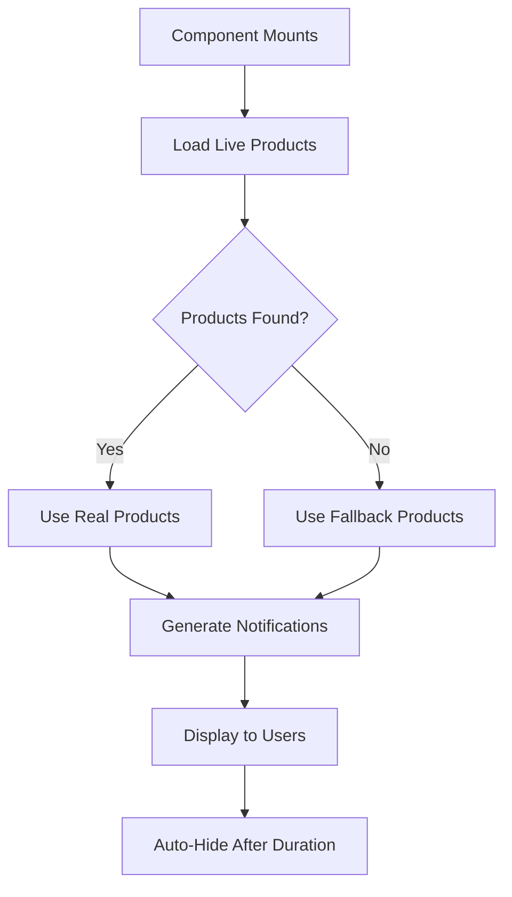

# 📢 In-App Notification System

## Overview

The Baguri platform features a dynamic scarcity notification system that displays real-time social proof to encourage purchases. The notifications now use **real live products** from approved designers instead of mock data.

## ✨ Features

### **Real Product Integration**
- **Live Products**: Uses actual products marked as `is_live = true` from approved designers
- **Dynamic Content**: Shows real product names and designer brands
- **Automatic Updates**: Loads fresh product data when component mounts
- **Fallback System**: Uses mock products if no live products are available

### **Notification Types**

1. **Recent Purchase** 🛍️
   - `"Alexandra M. from Bucharest just bought "Silk Evening Dress" by Atelier Mia"`
   - Shows customer name + location + product + designer

2. **High Interest** 👀  
   - `"23 people are currently viewing "Handwoven Scarf" by Vestige Co"`
   - Creates urgency with viewer count

3. **Low Stock Alert** ⏰
   - `"Only 3 left of "Minimalist Tote" by Nova Studio - hurry!"`
   - Urgent notifications for scarcity

4. **Trending Now** 📈
   - `"Designer Blazer" by Urban Luna is popular - 12 sold today"`
   - Social proof with sales numbers

## 🔧 Technical Implementation

### **Database Integration**

```sql
-- Query used to load live products
SELECT 
  id,
  name, 
  price,
  designers!designer_id (brand_name)
FROM designer_products 
WHERE is_live = true 
  AND designers.status = 'approved'
LIMIT 20;
```

### **Component Usage**

```tsx
// Used in shop page and other customer-facing pages
<ScarcityNotifications 
  enabled={true}
  interval={180} // Show notification every 3 minutes
  maxVisible={2}
/>
```

### **Smart Loading**
- **Initial Load**: Fetches live products from database on mount
- **Error Handling**: Falls back to mock products if database fails
- **Performance**: Limits to 20 products to prevent over-fetching
- **Caching**: Products loaded once per session

## 📊 Configuration

### **Timing Settings**
- **Interval**: 180 seconds (3 minutes) between notifications
- **Duration**: 6-10 seconds per notification type
- **Max Visible**: 2 notifications shown simultaneously
- **Snooze**: 51 seconds when dismissed

### **Customer Data**
- **Names**: Romanian names for authenticity  
- **Locations**: Major Romanian cities
- **Metrics**: Realistic viewer counts (3-30) and stock levels (1-8)

## 🎯 Benefits

### **For Customers**
- **Social Proof**: See real products people are buying
- **Urgency**: Low stock alerts create purchase motivation  
- **Discovery**: Learn about new designers and products
- **Trust**: Real product names build credibility

### **For Designers**
- **Marketing**: Free promotion through notifications
- **Sales**: Increased conversion through social proof
- **Visibility**: Products featured to browsing customers
- **Authenticity**: Real brand names build trust

## 🔄 Data Flow



## 🚀 Future Enhancements

- **Real Purchase Events**: Trigger notifications from actual Stripe webhooks
- **User Behavior**: Track real page views for "High Interest" notifications  
- **Inventory Integration**: Use actual stock levels for "Low Stock" alerts
- **A/B Testing**: Optimize notification frequency and content
- **Personalization**: Show relevant products based on user browsing

---

*The notification system creates authentic social proof that helps drive conversions while showcasing real designer products and brands.* 