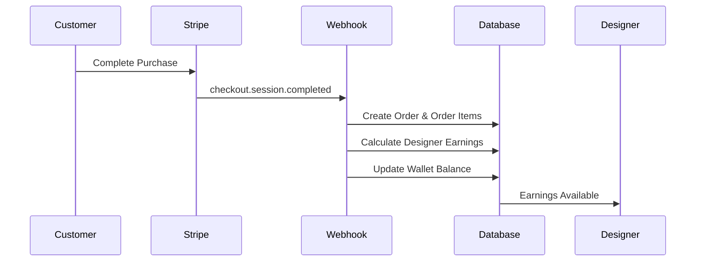

# 💰 Wallet & Affiliate Fee System

## Overview

The Baguri platform features a comprehensive wallet and affiliate fee system that automatically calculates and distributes earnings to designers when their products are sold. This system ensures transparent, automated commission payments based on configurable affiliate fee percentages.

## 🏗️ System Architecture

### Database Schema

#### 1. Designers Table (Enhanced)
```sql
ALTER TABLE designers 
ADD COLUMN affiliate_fee_percentage DECIMAL(5,2) DEFAULT 70.00 NOT NULL;
```
- **affiliate_fee_percentage**: Commission rate for the designer (default: 70%)

#### 2. Orders Table
```sql
CREATE TABLE orders (
    id UUID PRIMARY KEY,
    stripe_payment_intent_id TEXT UNIQUE,
    stripe_checkout_session_id TEXT,
    customer_email TEXT,
    customer_name TEXT,
    total_amount DECIMAL(10,2) NOT NULL,
    currency TEXT DEFAULT 'ron',
    status TEXT CHECK (status IN ('pending', 'completed', 'failed', 'refunded')),
    created_at TIMESTAMP DEFAULT NOW(),
    updated_at TIMESTAMP DEFAULT NOW()
);
```

#### 3. Order Items Table
```sql
CREATE TABLE order_items (
    id UUID PRIMARY KEY,
    order_id UUID REFERENCES orders(id),
    designer_id UUID REFERENCES designers(id),
    product_id UUID REFERENCES designer_products(id),
    product_name TEXT NOT NULL,
    product_price DECIMAL(10,2) NOT NULL,
    quantity INTEGER DEFAULT 1,
    designer_earnings DECIMAL(10,2) NOT NULL, -- Calculated based on affiliate fee
    created_at TIMESTAMP DEFAULT NOW()
);
```

#### 4. Designer Wallets Table
```sql
CREATE TABLE designer_wallets (
    id UUID PRIMARY KEY,
    designer_id UUID UNIQUE REFERENCES designers(id),
    balance DECIMAL(10,2) DEFAULT 0.00,
    total_earnings DECIMAL(10,2) DEFAULT 0.00,
    total_withdrawn DECIMAL(10,2) DEFAULT 0.00,
    pending_balance DECIMAL(10,2) DEFAULT 0.00,
    created_at TIMESTAMP DEFAULT NOW(),
    updated_at TIMESTAMP DEFAULT NOW()
);
```

#### 5. Wallet Transactions Table
```sql
CREATE TABLE wallet_transactions (
    id UUID PRIMARY KEY,
    wallet_id UUID REFERENCES designer_wallets(id),
    type TEXT CHECK (type IN ('sale', 'withdrawal', 'refund', 'adjustment')),
    amount DECIMAL(10,2) NOT NULL,
    status TEXT CHECK (status IN ('pending', 'completed', 'failed')),
    description TEXT NOT NULL,
    order_id UUID REFERENCES orders(id),
    order_item_id UUID REFERENCES order_items(id),
    stripe_transfer_id TEXT,
    created_at TIMESTAMP DEFAULT NOW(),
    updated_at TIMESTAMP DEFAULT NOW()
);
```

## 🔄 Workflow

### 1. Product Sale Process



### 2. Earnings Calculation

For each product sold:
```javascript
const designerEarnings = productPrice * quantity * (affiliateFeePercentage / 100);
```

**Example:**
- Product Price: 200 RON
- Quantity: 1
- Designer Affiliate Fee: 70%
- **Designer Earnings: 140 RON**
- **Platform Fee: 60 RON**

### 3. Automatic Processing

When a Stripe webhook receives `checkout.session.completed`:

1. **Extract Order Data**: Parse customer info, line items, and payment details
2. **Identify Designers**: Match products to designers via metadata
3. **Calculate Earnings**: Apply affiliate fee percentage to each item
4. **Create Records**: Store order, order items, and transactions
5. **Update Wallets**: Add earnings to designer balances
6. **Send Notifications**: Email designers about new sales

## 🎯 Key Features

### For Designers

#### Dashboard Wallet Section
- **Available Balance**: Funds ready for withdrawal
- **Total Earnings**: Lifetime earnings from sales
- **Total Withdrawn**: Historical withdrawal amount
- **Order Count**: Number of completed orders
- **Commission Rate**: Current affiliate fee percentage

#### Withdrawal System
- **Minimum Amount**: 50 RON
- **Processing Time**: 1-3 business days
- **Bank Transfer**: Direct to designer's IBAN
- **Transaction History**: Complete audit trail

### For Administrators

#### Affiliate Fee Management
- **Configurable Rates**: Set custom rates per designer
- **Default Rate**: 70% for new designers
- **Bulk Updates**: Modify rates for multiple designers
- **Rate History**: Track changes over time

#### Financial Oversight
- **Order Tracking**: Monitor all sales and commissions
- **Withdrawal Management**: Approve/process withdrawals
- **Revenue Analytics**: Platform vs. designer earnings
- **Dispute Resolution**: Handle payment issues

## 🔧 Implementation Details

### Stripe Webhook Handler
```typescript
// src/app/api/webhooks/stripe/route.ts
export async function POST(request: NextRequest) {
  const event = stripe.webhooks.constructEvent(body, sig, endpointSecret);
  
  switch (event.type) {
    case 'checkout.session.completed':
      await handleCheckoutCompleted(event.data.object);
      break;
    // ... other events
  }
}
```

### Earnings Calculation Function
```sql
-- Database stored procedure
CREATE FUNCTION process_order_earnings(p_order_data JSONB) 
RETURNS BOOLEAN AS $$
DECLARE
    v_designer_earnings DECIMAL(10,2);
    v_affiliate_fee DECIMAL(5,2);
BEGIN
    -- Calculate earnings based on affiliate fee
    v_designer_earnings := (item_price * quantity) * (v_affiliate_fee / 100.0);
    
    -- Update wallet balance
    UPDATE designer_wallets 
    SET balance = balance + v_designer_earnings,
        total_earnings = total_earnings + v_designer_earnings;
        
    -- Create transaction record
    INSERT INTO wallet_transactions (...);
    
    RETURN TRUE;
END;
$$ LANGUAGE plpgsql;
```

### Designer Service Methods
```typescript
// Get affiliate fee percentage
async getAffiliateFeePercentage(designerId: string): Promise<number>

// Update affiliate fee (admin only)
async updateAffiliateFeePercentage(designerId: string, percentage: number)

// Get sales summary
async getDesignerSalesSummary(designerId: string)

// Process withdrawal
async processWithdrawal(designerId: string, amount: number, stripeTransferId?: string)
```

## 📊 Analytics & Reporting

### Designer Analytics
- **Sales Performance**: Revenue trends over time
- **Product Performance**: Best-selling items
- **Commission Tracking**: Earnings breakdown
- **Withdrawal History**: Payment records

### Platform Analytics
- **Total Revenue**: Platform + designer earnings
- **Commission Distribution**: Fee percentage analysis
- **Designer Performance**: Top earners and sellers
- **Financial Health**: Cash flow and projections

## 🔒 Security & Compliance

### Data Protection
- **Row Level Security**: Designers see only their data
- **Encrypted Transfers**: Secure bank account information
- **Audit Trails**: Complete transaction logging
- **GDPR Compliance**: Data privacy protection

### Financial Security
- **Webhook Verification**: Stripe signature validation
- **Transaction Integrity**: Atomic database operations
- **Fraud Prevention**: Suspicious activity monitoring
- **Backup Systems**: Data redundancy and recovery

## 🚀 Deployment

### Environment Variables
```bash
# Stripe Configuration
STRIPE_SECRET_KEY=sk_live_...
STRIPE_WEBHOOK_SECRET=whsec_...

# Database
DATABASE_URL=postgresql://...
SUPABASE_SERVICE_ROLE_KEY=...

# Email Notifications
RESEND_API_KEY=re_...
```

### Database Migration
```sql
-- Run the complete migration script
\i database_migrations.sql
```

### Webhook Setup
1. **Create Webhook Endpoint** in Stripe Dashboard
2. **Set URL**: `https://yourdomain.com/api/webhooks/stripe`
3. **Select Events**: 
   - `checkout.session.completed`
   - `payment_intent.succeeded`
   - `payment_intent.payment_failed`
4. **Copy Webhook Secret** to environment variables

## 📈 Future Enhancements

### Planned Features
- **Multi-Currency Support**: EUR, USD alongside RON
- **Tiered Commission Rates**: Performance-based fee adjustments
- **Instant Withdrawals**: Real-time bank transfers
- **Tax Reporting**: Automated tax document generation
- **Designer Loans**: Advance payments against future sales

### Integration Opportunities
- **Accounting Software**: QuickBooks, Xero integration
- **Banking APIs**: Direct bank account verification
- **Analytics Platforms**: Advanced reporting dashboards
- **Mobile App**: Designer earnings mobile interface

## 🎉 Benefits

### For Designers
✅ **Transparent Earnings**: Clear commission structure  
✅ **Automated Payments**: No manual invoice processing  
✅ **Real-time Tracking**: Live sales and earnings data  
✅ **Fast Withdrawals**: Quick access to funds  
✅ **Complete History**: Full transaction records  

### For Platform
✅ **Automated Operations**: Reduced manual processing  
✅ **Scalable System**: Handles unlimited designers/sales  
✅ **Financial Control**: Complete revenue oversight  
✅ **Compliance Ready**: Audit-friendly transaction logs  
✅ **Growth Enablement**: Easy onboarding for new designers  

---

**The wallet and affiliate fee system transforms Baguri into a fully automated marketplace where designers can focus on creating while the platform handles all financial operations seamlessly.** 🎨💰 